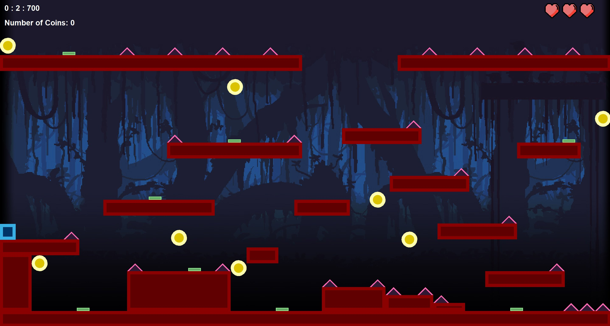
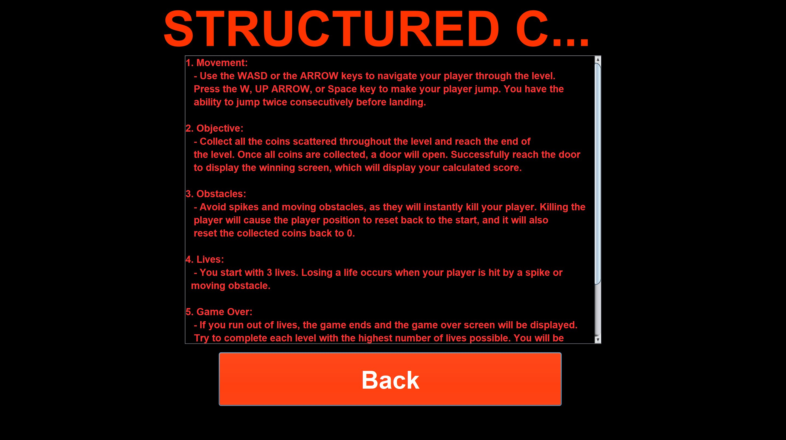
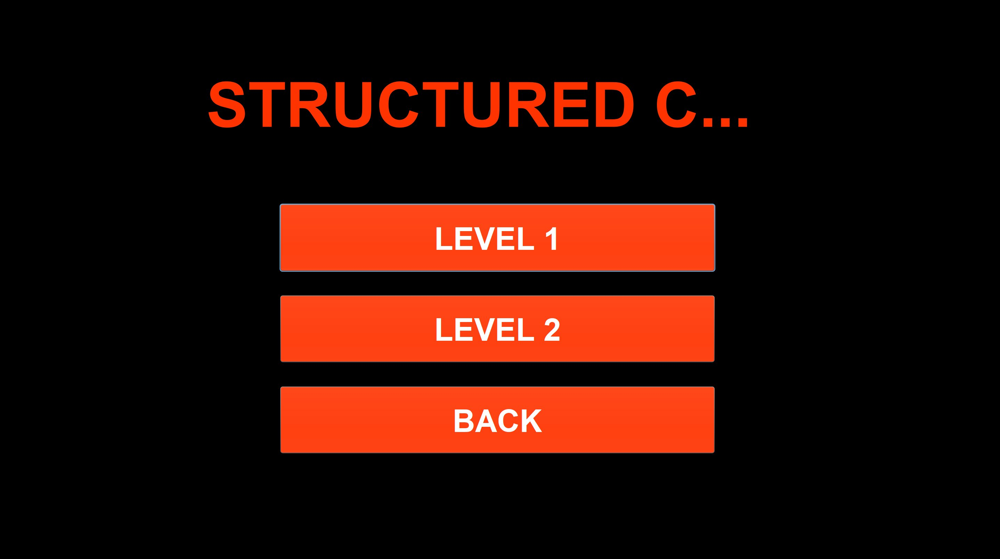
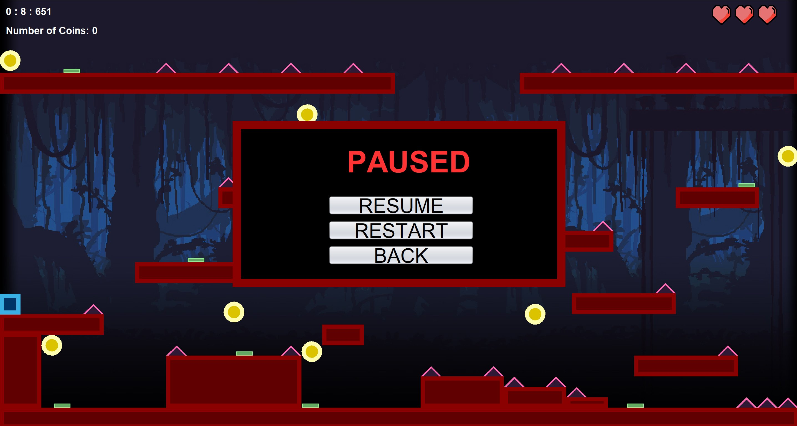
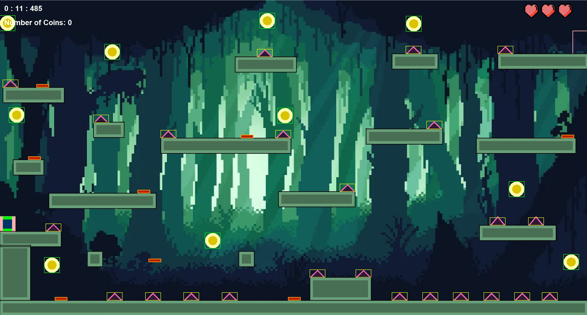

# STRUCTURED CHAOS

A 2D platformer built from scratch in Java (Swing/AWT), created as a Grade 11 Introduction to Computer Science final project. Co-authored with Munsif.

Jump across platforms, dodge spikes and moving obstacles, collect every coin in the level, and reach the door before you run out of lives.



## Features

- **Double jump** movement with gravity and custom collision detection (feet, head, and side hitboxes)
- **2 levels** with distinct art styles and their own music — a red cave level and a green forest cave level
- **Coins** to collect — the exit door only opens once every coin in the level is picked up
- **Spikes and moving obstacles** that instantly cost you a life and reset your position and coin count back to the start
- **3 lives**, shown as heart icons in the top-right corner; run out and it's game over
- **Live HUD** showing elapsed time, lives remaining, and coins collected
- **Pause menu** (`Esc`) with resume, restart, and back-to-menu options
- **Scoring** based on how quickly you finish and how many lives you have left: `score = (10000 - time taken) + (2500 × lives remaining)`
- A debug hitbox view (`H` key) for visualizing collision boxes while playing

| Main Menu | Instructions |
|---|---|
|  |  |

| Level Select | Pause Menu |
|---|---|
|  |  |

**Level 2:**



## Controls

| Key | Action |
|---|---|
| `W` / `↑` / `Space` | Jump (double jump supported) |
| `A` / `←` | Move left |
| `D` / `→` | Move right |
| `Esc` | Pause / resume |
| `H` | Toggle hitbox display (debug) |

## How it's built

- **`Player`** handles movement, gravity, and collision detection against platforms, obstacles, coins, and the door.
- **`Platform`**, **`Coin`**, **`Obstacle`**, and **`Door`** are their own classes, each responsible for drawing themselves and exposing the hitbox data `Player` checks against. `Obstacle` supports both static spikes and moving obstacles that patrol back and forth.
- **`LevelManager`** owns the shared per-level game loop: tracking lives, the timer, drawing the heart/lives UI, checking win/lose conditions, and calculating the final score.
- Each screen — main menu, level selector, level 1, level 2, instructions — is its own `JFrame` subclass, wired together through button handlers that pass control from one screen to the next.

## Tech

- Java (Swing / AWT for rendering and UI)
- Apache Ant / NetBeans project structure
- GUI forms built with NetBeans' GUI Builder (`.form` files)

## Running it

This is a NetBeans (Ant-based) project, so the simplest way to run it:

1. Open the project folder in NetBeans (File → Open Project).
2. Let it index, then click Run (or press F6).

Or, with a JDK and Ant installed, from the project root:

```
ant run
```

## Structure

```
src/finalprogrammingproject/   Java source + NetBeans .form files
screenshots/                   Real gameplay screenshots (for this README)
pixelify-sans/                 Font used in the UI
*.wav                          Level and menu music
*.jpg / *.png                  Backgrounds and UI assets
build.xml                      Ant build script
```

## Notes

Built with Munsif as a two-person Grade 11 final project. This isn't actively maintained, but it's preserved here as a portfolio piece.
